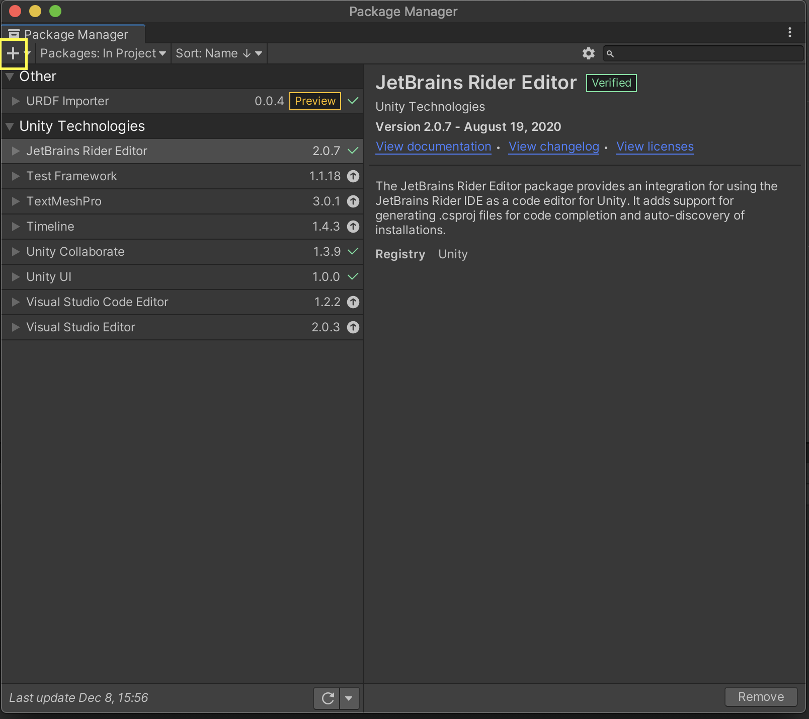

# P8_duaro

## Table of contents

- [Getting Started](#Purpose-Started)
- [Project Details](#Project-Details)
- [Authors](#Authors)
- [References](#References)

## Getting Started: 

### Unity

1. This project is developed and tested with Unity Version 2020.3.29f1. Install the version through the Unity Hub from this [link](https://unity3d.com/de/get-unity/download/archive)

2. Clone the repository `$ git clone https://github.com/AndreiVoica/P8_duaro.git` and `$ catkin_make`.

3. Open the Unity Project [Unity_env](/Unity_env) in your Unity Hub.

### Installing plugins

1. Open the Package Manager from Unity Menu. Click `Window -> Package Manager`. A new package manager window will appear.

2. Click on the `+` sign on the top left corner of the package manager window and click on `Add Package from Git URL`. 



3. Install the URDF Importer: Enter the git URL for the URDF Importer with the latest version tag (currently v0.5.2) `https://github.com/Unity-Technologies/URDF-Importer.git?path=/com.unity.robotics.urdf-importer#v0.5.2` in the text box and press `Enter`. For more information follow this [link](https://github.com/Unity-Technologies/URDF-Importer)

4. Install the ROS-TCP-Connector: Enter `https://github.com/Unity-Technologies/ROS-TCP-Connector.git?path=/com.unity.robotics.ros-tcp-connector`.

### Setup TCP connection on your terminal (Unity-ROS)

1. Source the workspace:`$ source devel/setup.bash`

2. Run: `$ roslaunch ros_tcp_endpoint endpoint.launch`
For more information follow this [link](https://github.com/Unity-Technologies/Unity-Robotics-Hub/blob/main/tutorials/ros_unity_integration/setup.md)

### ML-agents

1. Install the com.unity.ml-agents package through the Package Manager in Unity. This project is tested with version 2.2.1.

2. Install Python 3.6 or 3.7. If needed, create a virtual environment for this, for example as described in this [link](https://uoa-eresearch.github.io/eresearch-cookbook/recipe/2014/11/20/conda/).


3. Install the mlagents Python package: `$ python -m pip install mlagents==0.28.0`. This project uses the version 0.28.0. 

4. Try to run `$ mlagents-learn --help` to ensure it works. 

### ROS-Unity connection

1. Under `Robotics` tab go to `ROS settings` and change the IP to `127.0.0.1` Port: `10000`.

    
2. In the Unity scene, go to the `Ros_connection` game object and change the IP to `127.0.0.1`.

    
    
### Build msgs in Unity

1. Under `Robotics` tab go to `Generate ROS messages`.
2. Press `Browse` add select your `src` folder location. 


    
3. Build all the msgs, srvs and actions as shown here:


    

### Run tests

Run:
```bash
roslaunch khi_duaro_moveit_config test.launch
```
This will start the tcp connection and start the python script containing the goal positions for Duaro.

You can press `Play` in Unity before or after runnning the above command.

Rviz can be ignored, although it will be used for a bit while we create the skills. (Update this line at a later date)


### ML Agents

#### Getting Started:
- Getting started example [link](https://github.com/Unity-Technologies/ml-agents/blob/main/docs/Getting-Started.md)

#### Examples to try out:
- Create new environment [link](https://github.com/Unity-Technologies/ml-agents/blob/main/docs/Learning-Environment-Create-New.md)
- Environment examples [link](https://github.com/Unity-Technologies/ml-agents/blob/main/docs/Learning-Environment-Examples.md)

#### Relevant Documentation:
- [ML Agents Overview](https://github.com/Unity-Technologies/ml-agents/blob/main/docs/ML-Agents-Overview.md)
- [Info about agents and decisions](https://github.com/Unity-Technologies/ml-agents/blob/main/docs/Learning-Environment-Design-Agents.md#decisions) 
- [Reward signals and hyperparameters](https://github.com/Unity-Technologies/ml-agents/blob/main/docs/Training-Configuration-File.md)
- [Headless Training](https://github.com/Unity-Technologies/ml-agents/blob/main/docs/Learning-Environment-Executable.md)
- [Docker for ML Agents](https://github.com/Unity-Technologies/ml-agents/blob/main/docs/Using-Docker.md)
- [Unity ML Agents Gym Wrapper](https://github.com/Unity-Technologies/ml-agents/blob/main/gym-unity/README.md)
- [Python API](https://github.com/Unity-Technologies/ml-agents/blob/main/docs/Python-API.md)


## Project Details: 


## Authors:

### Who do I talk to? ###

Group number: 865

Group members e-mail:
* Adshya Vasudavan Iyer: avasud11@student.aau.dk
* Andrei Voica: avoica18@student.aau.dk
* Daniel Moreno París: dmoren21@student.aau.dk
* Lekshmi Jayakrishnan: ljayak18@student.aau.dk
* Sabrina Kern: skern21@student.aau.dk
