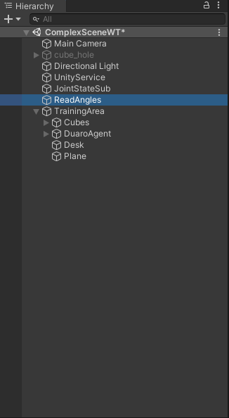

# How to use guide

## Trying different RL models

1. In the unity project, go to `Hierarchy` in the left side, click on the arrow next to `Training area` and then select `DuaroAgent`

 Figure 1

2. Once the `DuaroAgent` is selected as presented in above image, you can go to the inspector on the right side of the screen and scroll down until where you see 2 components called `Behavior Parameters` and `Duaro Agent Complex WT`. 

 Figure 2

3. To try different models, make sure that Inference Device and Behavior Type are both set to `Default`.

4. Navigate to the Project window and select the folder named `TFModels`. This folder contains different trained models that can be applied to the Duaro robot. 

 Figure 3

5. To apply a model to the robot, click and drop the desired model in the `Behavior Parameters` under `Model`. (Figure 2)

6. Click the play bottom on the top.

## Record the model

1. In the `Hierarchy` section, select `ReadAngels` game object.

 Figure 4

2. In the `Inspector` make sure that `Record Model` script is selected.

 Figure 5

## Manual control

1. If you want to use the keyboard to manually control the robot, in the `Behavior Parameters` under `Behavior Type` select `Heuristic only` as seen in Figure 4.

 Figure 4

2. Remove the trained model in the `Behavior Parameters` under `Model`. To do so click the circled bottom next to the model and on the pop-up screen select None as seen in Figure 5.

 Figure 5

3. Go to `Scripts` folder and open the `DuaroAgentComplexWT.cs` script.

 Figure 6

4. Comment lines 199 through 207 

 Figure 7

5. Press `Play` and use the keys from A to N to control the robot or to reset the episode.
